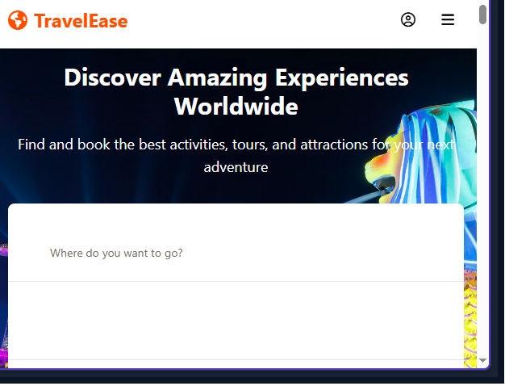

# TravelEase - Travel Activities Marketplace

TravelEase is a comprehensive travel activities marketplace platform similar to Klook, designed for discovering, browsing, and booking tours and activities worldwide.

## 🌟 Features

- **Browse Activities**: Explore a wide range of travel activities, tours, and experiences
- **Destination Search**: Find activities based on location and category
- **Detailed Activity Pages**: View comprehensive information about each activity, including descriptions, itineraries, and reviews
- **Booking System**: Select dates, times, and number of participants with a simple booking flow
- **User Profiles**: Manage bookings and wishlists in a personalized user account
- **Special Deals**: Discover discounted offerings and special promotions

## 💻 Tech Stack

- **Frontend**: React with TypeScript
- **UI Components**: Shadcn UI + Tailwind CSS
- **State Management**: React Query for API data fetching
- **Routing**: Wouter for lightweight routing
- **Backend**: Express.js
- **Database**: In-memory data store (development version)
- **Authentication**: Simple authentication system (for demonstration)

## 📱 Application Structure

- **Home Page**: Featured destinations, popular activities, and special deals
- **Destinations Page**: Browse all available destinations
- **Activities Page**: Filter and search for activities with various criteria
- **Activity Detail Page**: In-depth information about each activity
- **Checkout Flow**: Booking form and payment simulation
- **User Profile**: Account management, booking history, and wishlist

## 🌐 API Endpoints

The backend provides the following API endpoints:

- **Categories**: `/api/categories`
- **Destinations**: `/api/destinations`
- **Activities**: `/api/activities`
- **Reviews**: `/api/activities/:id/reviews`
- **Bookings**: `/api/bookings`
- **User Management**: `/api/auth/*` and `/api/users/*`

## ✨ Future Enhancements

- Persistent database integration
- Payment processing with a real payment gateway
- Email notifications for bookings
- Mobile application
- Advanced search and filtering capabilities
- Multi-language support

silahkan email habizinnia@gmail.com jika butuh repo ini
